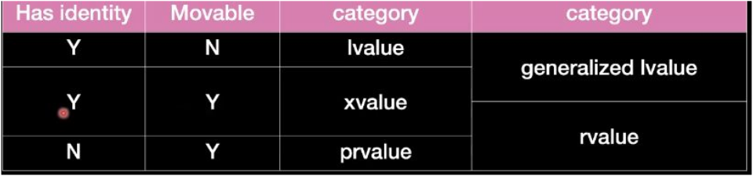
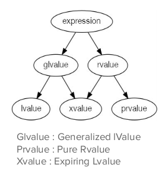

# Introduction
## C++ 
- is an extension of the C programming language
- Object-Oriented language
- statically-typed language
- we will work with C++14 and C++17 in this course 
- c++ is the same as c in basic data types 

## C basic data types 
- integer: signed/unsigned & int/short int/long int
- floating point: float/double/long double
- character: char/signed char/unsigned char
- the size of any data type is directly dependent on the compiler along with the target processor


```c
unsigned char x = -1;
printf("%d",x);
```
- this outputs 255 as -1 is full ones and in unsigned char that represents 255


```c
char x = 255;
printf("%d",x);
```
- this outputs -1 as char is signed by defualt so 255 "ful ones" represents -1

```c
char x = 128;
printf("%d",x);
```
- this outputs -128 as char is signed by defualt and 128 represents -128

```c
char x = 258;
printf("%d",x);
```
- this outputs -2 as char is stored in one byte and 258 binary representation is 100000010 so the MSB is ignored and 00000010 is left which is 2


## c++ input & output

```cpp
#include <iostream>
int main()
{
    int x;
    std::cin>>x;
    std::cout<<x<<"\n";
    return 0;
}
```

## c++ manipulators 
- check cpprefrence.com::input/output manipulators 
- focus on the manipulators of diffrent number bases
- rembeber to reset the manipulator as you finish using it
- example on manipulators:
```cpp
#include <iostream>
#include <iomanip>

int main() {
    int num = 255;
    std::cout << std::hex << num << std::endl; // Outputs in hexadecimal
    std::cout << std::dec << num << std::endl; // Outputs in decimal
    return 0;
}
```


## C++ memory sections same as C

## C++ operators same as C

## C++ conditional statements same as C

## C++ loops same as C except ranged based loop
```cpp
#include <iostream>
#include <vector>
int main()
{
    std::vector<int> numbers = {1, 2, 3, 4, 535};
    for (int num : numbers) 
    {
        std::cout<<num<<"\n";
    }
    return 0;
}
```


# Derived
# Functions
## basic function
- basic functions as same as C
- Except that we can add defualt parameters
```cpp
#include <iostream>
void printMessage(std::string message = "Hello, World!") {
std::cout << message << std::endl;
}

int main() {
printMessage(); // Prints default message
printMessage("Hi there!"); // Prints custom message
return 0;
}

``` 
- tricky:
```cpp
#include <iostream>
void fun(int x = 2, int y);
void fun(int x, int y) {
    std::cout << x << " " << y << std::endl;
}

int main() {
    fun(2);
    return 0;
}
```
- this code results an error as when you add default paramter the following parameters must have default values also
- correct code 

```cpp
#include <iostream>
void fun(int y, int x=2);
void fun(int y, int x) {
    std::cout << x << " " << y << std::endl;
}

int main() {
    fun(3);
    return 0;
}
```
- output: 2 3

## Function overloading 
- Function overloading allows multiple functions to have the same name with different parameters. The correct function to be called is determined by the arguments provided.
```cpp
#include <iostream>

void print(int i) {
    std::cout << "Integer: " << i << std::endl;
}

void print(double f) {
    std::cout << "Double: " << f << std::endl;
}

void print(const std::string &s) {
    std::cout << "String: " << s << std::endl;
}

int main() {
    print(10);
    print(3.14);
    print("Hello, World!");
    return 0;
}
```
## Ambiguous function call
```cpp
void fun(int x, int y = 3){
std::cout << x <<" " << y << std::endl;
}
void fun(int x, float y = 3){
std::cout << x <<" " << y << std::endl;
}
int main()
{
    fun(2);
    return 0;
}
```
- the function call is ambiguous


## Mangling 
- Name mangling is the process where the compiler generates unique names for each function based on their parameters. This allows function overloading to work. Mangled names are often compiler-specific.
##Demangling
- to see how your functions are mangled 
- seeing mangling: grep on your function name in the objdump file 
```
objdump -t --demangle | grep fun_name
```
-demangling: using c++filt tool
```
c++filt mangled_name_of_function
```

#Arrays
## Declaration
To declare an array, specify the type of elements and the number of elements in brackets.

```cpp
int numbers[6]; // Declare an integer array with 6 elements
```
## Initialization
- Arrays can be initialized when declared.
```cpp
int numbers[6] = {2, 4, 8, 12, 16, 18}; // Initialize array elements
```
- or 
```cpp
int numbers[] = {2, 4, 8, 12, 16, 18}; // Compiler determines the size
```
## Accessing Elements
```cpp
for (int i = 0; i < 6; ++i) {
    cout << numbers[i] << " ";
}
```
- or use ranged loop
```cpp
int numbers[] = {0, 1, 2, 3, 4, 5};
for (int value : numbers) {
    std::cout << value << " ";
}
```
## Memory Layout
- Memory layout of arrays in C++ involves contiguous memory allocation for array elements.

# Pointers
- it have tha same rules as c pointers
## pointer to function syntax
```cpp
#include <iostream>
void greet() {
    std::cout << "Hello, World!" << std::endl;
}
int main() {
    void (*funcPtr)() = greet;
    funcPtr();
    return 0;
}
```
## Arrays and Pointers

- Arrays are closely related to pointers:

```cpp
int arr[5] = {1, 2, 3, 4, 5};
int *ptr = arr; // Pointer points to the first element of the array

## Pointer Arithmetic
```cpp
int *nextPtr = ptr + 1; // Points to the next element in the array
```

# References
- References are aliases(another names) for other variables.
```cpp
#include <iostream>
int main() {
    int a = 10;
    int &b =a;
    b=8;
    std::cout << a << " ";
    std::cout << b << "\n";
    return 0;
}
```
- output: 8 8

## Calling By References
```cpp
#include <iostream>

void byValue(int x) {
    x = 100;
}

void byPointer(int *x) {
    *x = 100;
}

void byReference(int &x) {
    x = 100;
}

int main() {
    int a = 10;
    byValue(a);
    std::cout << "By value: " << a << std::endl;

    byPointer(&a);
    std::cout << "By pointer: " << a << std::endl;

    byReference(a);
    std::cout << "By reference: " << a << std::endl;

    return 0;
}
```
- output: By value: 10
- By pointer: 100
- By reference: 100

## Null Pointer
- The diffrence between nullptr and NULL
- using NULL
```cpp
#include <iostream>

void foo(int) {
    std::cout << "Called foo(int)" << std::endl;
}

void foo(char*) {
    std::cout << "Called foo(char*)" << std::endl;
}

int main() {
    foo(NULL); // Ambiguous: could call either foo(int) or foo(char*)
    return 0;
}
```
- using nullptr
```cpp
#include <iostream>

void foo(int) {
    std::cout << "Called foo(int)" << std::endl;
}

void foo(char*) {
    std::cout << "Called foo(char*)" << std::endl;
}

int main() {
    foo(nullptr); // Unambiguous: calls foo(char*)
    return 0;
}
```
## Dynamic Memory Allocation
- Allocation:
```cpp
int *ptr = new int;
*ptr = 43;
```
- Deallocation
```cpp
delete ptr;
ptr = nullptr;
```

## auto keyword
```cpp
auto var = 10;
auto var2 = 10.5;

auto var3 = 'a';
auto var4 = const char*;
auto var5 = std::string("hello String ");

// with const
const int x = 10;
auto var6 = x; // var is int
//** to make it const
const auto var7 = x;
// with referance const works as expectd 
auto &var8 = x;
// with pointer const works as expectd  
auto ptr = &;

// std::initliaizer_list
auto Ist = {1, 2, 3, 4, 5};
// error
// auto lst{l, 2, 3, 4};
return 0;
```

# Casting in C++
## C style Cast
- c style cast can cause many problems as it allows casting between any type of pointers without compiler checking 
```cpp
char c = 'a';
int * ptr = (int*)&c;
```
- In c style cast this will not cause error, and it can cause many problems as the pointer ptr is accessing more 3 pytes after the char c and it can be an important part of memory

## static_cast
- whenever you need to use c style cast use static cast instead 
```cpp
char c = 'a';
int * ptr = (int*)&c;  //no error
int* ptr2 = static_cast<int*>(&c);   //error
```

## const_cast
- const_cast is used to cast away the constness of variables
- Rule 5-2-5 (Required) A cast shall not remove any const or volatile qualification from the type of a pointer or reference.
- So, it is a bad practice 
```cpp
#include <iostream>
int main() {
    const int val = 10;
    const int* ptr = &val;
    //int *ptr2 = ptr;   //error
    int* ptr2 = const_cast<int*>(ptr);
    *ptr2=100;
    std::cout<<*ptr2<<" ";
    std::cout<<*ptr<<" ";
    std::cout<<val<<"\n";
 
    return 0;
}
```
- output: 100 100 10

## reinterpret_cast
- reinterpret_cast should be used with extreme caution. It allows casting between any types of pointers, but it
does not check the compatibility of the types, leading to potential errors and undefined behavior. Always
ensure that the types are compatible and the casting is safe when using reinterpret_cast.
- it is like c style cast
- example:
```cpp
#include <iostream>
struct data {
int x = 10;
int y = 100;
char c =0;
bool b = false;
};

int main() {
data d;
// int *p = static_cast<int *>(&d);  #ERROR
int *p = reinterpret_cast<int *>(&d);
std::cout << *p++ << " ";
std::cout << *p++ << " ";
std::cout << *p << "\n";
return 0;
}
```
- output: 10 100 0

## dynamic_cast
- postponed

# Lambda Expressions
## Syntax
- Lambda expressions provide a concise way to create anonymous function objects. The basic syntax is:

```cpp
auto func = []() {
    // function body
};
```
- You can also capture variables, pass parameters, and specify the return type:

```cpp
auto func = [captured_variables](parameters) -> return_type {
    // function body
};
```
## Capture List
- [captured_variables]: This is the capture list, which allows the lambda to access variables from its enclosing scope.

- [&] captures all variables by reference.
- [=] captures all variables by value.
- Specific variables can be captured by listing them, like [x, &y].
## Mutable Variables
- The mutable keyword allows modifying captured variables within the lambda
```cpp
[temp] mutable {
    return x + y;
};
```

## Return Type
- -> return_type: This specifies the return type of the lambda function. If omitted, the return type is deduced automatically.
## Implementation 

```cpp
// Lambda expression
auto lambda = [](int a, int b) -> int {
    return a + b;
};
```
## Auto type detection 
- Auto type detection in c++ is available in c++14 and above
## When we use it ?
- passing function as argument
```cpp
    auto sort_with_lambda = [](int input_arr[], int output_arr[], int order, size_t size) {
        std::copy(input_arr, input_arr + size, output_arr);}
```
- traceability
- return function


# Const vs Constexpr
## const
The const keyword is used to declare variables whose value cannot be changed after initialization. It can be used with variables, pointers, and member functions:

```cpp
const int x = 10;          // constant variable
const int* ptr = &x;       // pointer to a constant integer
int* const ptr2 = &x;      // constant pointer to an integer
```
## constexpr
The constexpr keyword is used to declare variables, functions, and objects that can be evaluated at compile time. This allows for optimizations and ensures that the value is constant:

```cpp
constexpr int y = 20;      // constant expression

constexpr int add(int a, int b) {
    return a + b;
}

constexpr int result = add(3, 4); // evaluated at compile time
```

### Differences
- const ensures that the value cannot be changed, but the value might be determined at runtime.
- constexpr ensures that the value is constant and can be evaluated at compile time.
```cpp
const int a = 5;
constexpr int b = 10;

int array1[a];           // This may not compile, depending on the compiler
int array2[b];           // This will always compile

constexpr int add(int x, int y) {
    return x + y;
}

int result = add(a, b);  // This will be evaluated at compile time
```

# OOP
## Initialization Types in C++

### Value Initialization:

- Initializes a variable to a known value.
- Example: int x{}; (x is initialized to 0).

### Direct Initialization:

- Calls the constructor directly.
- Example: int x(5); (x is initialized to 5).

### Copy Initialization:

- Initializes a variable using the value of another variable.
- Example: int x = 5; (x is initialized to 5).

### Uniform Initialization (C++11 and later):

- Uses curly braces {} for initializing variables.
- Prevents narrowing conversions.
- Example: int x{5}; (x is initialized to 5).

### the diffrence between them 
- in trivial datatypes {int,float,char,double,bool,struct variables}
- the diffrence will be in the folowing case:
```cpp
int main() {
int value1;//garbage
int value2{};//zero 
//another way for value initialization
int value3 = int{};
std::cout << value1<< " ";
std::cout << value3<< " ";
std::cout << value2 << "\n";
return 0;
}
```
- output: garbage value  0 0
- the same behavior will be will struct variables

- In vectors:
```cpp
 #include <iostream>
#include <iterator>
#include <vector>

/*ignore the detailes of this function for now */
template <typename T> void print(T data) {

std::copy(std::begin(data), std::end(data),std::ostream_iterator<int>(std::cout," "));
std::cout << std::endl;

}

int main() {
std::vector<int>v(12,3); //copy intializatin
std::vector<int>v2{12,3}; //value initialization
print(v);
print(v2);
return 0;
}
```
- output: 3 3 3 3 3 3 3 3 3 3 3 3 
12 3 

- you cannot use direct initailization ike that 
```cpp
int value(); //vexing parse
```
- it works like a function decleration 
### the best of them?
- in trivial data types the best is uniform initialization (value)
### narrow conversion 
```cpp
float decimal = 4.5;
int number = decimal; //no error (implicit casting)
int number2{decimal}; //error as the unifoem initialization cannot do implicit casting
```

## Enum
### C-Style Enum
- In C, enums are a way to assign names to integral constants, which makes the code more readable. However, they are not type-safe and can lead to naming conflicts.

```cpp
enum Color { RED, GREEN, BLUE };
Color color = RED;
```
### C++-Style Enum (enum class)
- C++ introduces enum class, which provides type safety and prevents naming conflicts. enum class members must be accessed using the scope resolution operator.

```cpp
enum class Color { RED, GREEN, BLUE };
Color color = Color::RED;
```
### C enum rules
```cpp
#include <iostream>
enum Traffic
{
    RED,
    YELLOW, // 1 i
    GREEN
};
int main() {
Traffic obj{};
std::cout << obj << " "; //can be printer like any integer
std::cout << Traffic::YELLOW << " ";
int number = RED; // convert from data type to another date type
// Traffic obj2 = 2; ERROR 
std::cout << sizeof(obj) <<"\n"; //4 and we didn't need all 4 bytes
}
```
- output: 0 1 4

### enum class rules 

```cpp
#include <iostream>
enum class Traffic : unsigned char          // 1 - specify size optional
{
    RED,
    YELLOW,
    GREEN
};

int main()
{
    Traffic obj;

    // std::cout << obj << std::endl;        // 2 - cannot print obj till operator overloading exist
    std::cout << (int)obj << " ";     // 3 - to print use casting *** till we exploit static_cast<int>(obj)

    //std::cout << RED << std::endl;          // 4 - ERROR you cannot access literals without class name
    std::cout << (int) Traffic::RED <<" "; // 5 - access enum class

    // int x = Traffic::RED;                 // 6 - cannot convert from enum to int
    // Traffic obj2 = 1;                     // 7 - ERROR cannot convert int to classic enum

    int y= static_cast<int>(Traffic::RED);
    Traffic obj2 = static_cast<Traffic>(1);
    std::cout << (int)obj2<<" "<<y<<"\n";

    // auto complet
    return 0;
}
```
- output: garbage 0 1 0

## Class and Struct
- they are the same only for now

### Encapsulation
- Encapsulation is the bundling of data and methods that operate on that data within a single unit or class, and restricting access to some of the object's components.
### class
- can contain functions and variabes 
- in memory members will be created acoording to the scope of the object as the normal variables 
- Stack Segment: Local variables, including object instances, are stored here.
- Heap Segment: Dynamically allocated memory (using new and delete).
- Text Segment: Stores compiled code (the program's executable instructions).
- BSS Segment: Uninitialized global and static variables.
- functions will be in .txt section
- only one function for the whole class
- when you create an object the constructor is called and stack frame is created
- stack frame contains the variables
- when the object scope is over the desctrutor is called
### Access Modifiers
- Public: Members are accessible from outside the class.
- Private: Members are only accessible from within the class itself.
- Protected: Members are accessible within the class and by derived class instances.

### the only diffrence between class and struct
- struct members are public bt default
- class members are private by defualt

### Functions
- when functions are defined inside the class definition it does not exist in the .txt except when you create an object of the class and use the function  
- when it's defined outside it exists
- it's better for the debugging proccess to write function definitions outsode the class definition 

### Constructors
#### Default Constructor: A constructor that takes no arguments.
- if no constructor is created by yu the compiler will creat a defualt one
 ```cpp
class MyClass {
public:
    MyClass() {}  // Default constructor
};
```
#### vexing parse
-  if you call the defualt constructor like this it is vexing parse
```cpp
MyClass obj();
```
#### How to call the  Default constructor
```cpp
MyClass obj1; //copy
MyClass obj2{}; //value
MyClass obj3 = MyClass(); //Direct
```

#### Parameterized Constructor: A constructor that takes one or more arguments.
- as you've defined a Parameterized Constructor the compiler will not generate default one
- in this case if you want to create en instance of your class with out parameters you need to define a defualt constructor your self
```cpp
class MyClass {
public:
    MyClass(int value) {}  // Parameterized constructor
};
```
#### This Pointer
this is an implicit pointer in C++ that points to the object for which a member function is called. It is used within a class's member functions to refer to the invoking object.

```cpp
class MyClass {
    int value;
public:
    void setValue(int value) {
        this->value = value;
    }
};
```
#### Important example on Parameterized Constructor
```cpp
class myData {
    public:
    // Default constructor
    myData() {
        std::cout << "default constructor" << std::endl;
    }

    // Parameterized constructor 1
    myData(int a) {
        std::cout << "parameterized constructor 1" << std::endl;
        this->a = a;
    }

    // Parameterized constructor 2
    myData(int a, int b) : myData(a) {
        std::cout << "parameterized constructor 2" << std::endl;
        this->b = b;
    }

    int a;
    int b;
};

int main() {
    // Example usage
    myData my2( 2,  3);
    std::cout << my2.a << " " << my2.b << std::endl;

    return 0;
}
```
- output: 
parameterized constructor 1
parameterized constructor 2
2 3

#### aggregate initialization 
- if yu do not have Parameterized Constructor you still can give the Default Constructor parameters and the compiler may be smart enough to understand
- It is a bad practise 
- example:
```cpp
class myData {
    // Default constructor
    myData() {
        std::cout << "default constructor" << std::endl;
    }


    int a;
    int b;
};

int main() {
    // Example usage
    myData my(a: 2, b: 3);
    std::cout << my2.a << " " << my2.b << std::endl;

    return 0;
}
```

#### Initializer List
- example:
```cpp
#include <iostream>

class myData {
    public:
    // Parameterized constructor 
    myData(int a,int b) 
    :a(a),b(b)
    {
        std::cout << "parameterized constructor 1" << std::endl;
    }

    int a;
    int b;
};

int main() {
    // Example usage
    myData my2( 2,  3);
    std::cout << my2.a << " " << my2.b << std::endl;

    return 0;
}
```
- output: 
parameterized constructor 1
2 3

- Put yur class vaiables in the initializer list in order
##### Cases where you need to use initializer list
```cpp
#include <iostream>

class myData {
public:
    // Parameterized constructor
    myData(int a, int b, int c, int d) 
    : a(a), b(b), internalC(c), c(internalC), d(d)
    {
        std::cout << "parameterized constructor" << std::endl;
    }

    int a;
    int b;
    int internalC;  // Internal storage for reference member
    int &c;         // Reference to internalC
    const int d;    // Constant member 
    const int e = 0; //or just initialize constant variables

};

int main() {
    // Example usage
    myData my2(2, 3, 4, 5);
    std::cout << my2.a << " " << my2.b << " " << my2.c << " " << my2.d << std::endl;

    return 0;
}
```

### const method
- 1- you cannot modify any variable(members)
- 2- you can create local variables and change them
- 3- you can modify the parameter value as well
- 4- you can modify static member (for future)
    4.1- you can modify reference member (for future)
    4.2- this doesn't match with the pointers
- 5- you can use mutable if you would like to modify the variable
- 6- const instance can only call const member functions
- 7- non-const instance can call both const and non-const member functions
- 8- non-const instance will call non-const methods even if there is const one
- const member functions shall not return non-cost reference or pointer to the class members

```cpp
#include <iostream>

class myData {
public:
    myData(int a, int b) : a(a), b(b), ptr(&this->a), number(this->b) {
        std::cout << "Parameterized constructor called." << std::endl;
    }

    int getter(int temp) const {
        std::cout << "Const getter called with temp = " << temp << std::endl;
        // a = 10; 1- you cannot modify any variable(members)
        // std::cout << "Trying to modify a non-mutable member: a = 10;" << std::endl;

        // 2- you can create local variables and change them
        int myvalue = 10;
        myvalue++;
        std::cout << "Local variable myvalue incremented: " << myvalue << std::endl;

        // 3- you can modify the parameter value as well
        temp++;
        std::cout << "Parameter temp incremented: " << temp << std::endl;

        // 4- you can modify static member (for future)
        classmember++;
        std::cout << "Static member classmember incremented: " << classmember << std::endl;

        // 4.1- you can modify reference member (for future)
        number = 100;
        std::cout << "Reference member number modified: " << number << std::endl;

        // 4.2- this doesn't match with the pointers
        // ptr = &a; 
        // std::cout << "Trying to modify pointer to member: ptr = &a;" << std::endl;

        return a;
    }

    void fun() const {
        std::cout << "Const fun called." << std::endl;
    }

    void test() {
        std::cout << "Non-const test called." << std::endl;
    }

    int getter(int temp) {
        std::cout << "Non-const getter called with temp = " << temp << std::endl;
        return a;
    }

private:
    int a; // 5- you can use mutable if you would like to modify the variable #bad practice
    int b;
    int* ptr;
    int& number;
    static int classmember;
};

int myData::classmember = 0;

int main() {
    // 6- const instance can only call const member functions
    const myData data(1, 2);
    std::cout << "Const instance data created." << std::endl;
    // data.test(); // error
    data.getter(5); // Calls const getter

    // 7- non-const instance can call both const and non-const member functions
    myData data2(2, 2);
    std::cout << "Non-const instance data2 created." << std::endl;
    data2.getter(5); // Calls non-const getter
    data2.fun(); // Calls const fun
    data2.test(); // Calls non-const test

    // 8- non-const instance will call non-const methods even if there is a const one
    std::cout << "Non-const getter result: " << data2.getter(5) << std::endl;

    return 0;
}
```
- output: Parameterized constructor called.
Const instance data created.
Const getter called with temp = 5
Local variable myvalue incremented: 11
Parameter temp incremented: 6
Static member classmember incremented: 1
Reference member number modified: 100
Parameterized constructor called.
Non-const instance data2 created.
Non-const getter called with temp = 5
Const fun called.
Non-const test called.
Non-const getter result: Non-const getter called with temp = 5
2

### Delete
```cpp
#include <iostream>
class Data {
public:
    bool flag = 1;
    int value = 0;

    Data() = delete;
    Data(int flag);
    void PrintInt();
};

Data::Data() {
    std::cout << "Default" << std::endl;
}

Data::Data(int flag) {
    // Implementation of the constructor
}
int main() {
    Data d; // Error: Attempting to use the deleted default constructor
    return 0;
}
```
- Error: Attempting to use the deleted default constructor
### Friend class
- A class that can be Access the private members of another class
- the class firendship is not mutual 
```cpp
#include <iostream>

// Forward declaration of RectangleAreaCalculator
class RectangleAreaCalculator;

class Rectangle {
private:
    double length;
    double width;

public:
    // Constructor to initialize the rectangle
    Rectangle(double l, double w) : length(l), width(w) {}

    // Declare RectangleAreaCalculator as a friend class
    friend class RectangleAreaCalculator;
};

class RectangleAreaCalculator {
public:
    // Method to calculate the area of the rectangle
    double calculateArea(const Rectangle& rect) {
        return rect.length * rect.width;
    }
};

int main() {
    // Create a Rectangle object
    Rectangle myRectangle(5.0, 3.0);

    // Create a RectangleAreaCalculator object
    RectangleAreaCalculator calculator;

    // Calculate and display the area
    double area = calculator.calculateArea(myRectangle);
    std::cout << "Area of the rectangle: " << area << std::endl;

    return 0;
}
```

### Friend function 
- a function or operator overloading that can access the private members of a class
```cpp
#include <iostream>

class temp; // forward declaration
void fun(); // forward declaration

class myData {
public:
    myData(int a, int b) : a(a), b(b) {}

private:
    int a;
    int b;
    friend void fun(); // 2- friend function

    // friend operator overloading (for future)
    friend std::ostream& operator<<(std::ostream& os, const myData& data) {
        os << data.a << " " << data.b;
        return os;
    }
};

void fun() {
    myData data(1, 2);
    std::cout << data.a << std::endl;
    std::cout << data.b << std::endl;
}

int main() {
    // Using the friend function
    fun();
    // Using the friend operator overloading
    myData data(3, 4);
    std::cout << data << std::endl;

    return 0;
}
```
### Static class member
- Static member is not related to instance, it is related to the class itself
- If a static data member of integral or enumeration type is declared const (and not volatile ), it can be initialized with an initializer in which every expression is a constant expression, right inside the class definition
```cpp
#include <iostream>
class myData {
public:
    myData() { counter++; }

    static int counter;
    static const int MAX = 5; // 4- it is related to class and also it is constant //spectial initialization for static const int as it is not exist in .rodata and we cannot send refrence to it (it is just an alias)
    static const int MIN;
    static const float PI;
    // static const int temp; // 7- Error if you would like to define in constructor

private:
    // Static member is not related to instance, it is related to the class itself
    int n;
};

// 1- Definition should be outside the class
int myData::counter = 0;

// 6- It should be initialized outside the class
const int myData::MIN = 0;

// 6.1- It should be initialized outside the class & not integral data type
const float myData::PI = 3.14;

int main() {
    // Creating a vector of myData objects
    // std::vector<myData> v(5);

    myData d1;
    myData d2;
    myData d3;
    myData d4;
    myData d5;

    // Accessing and printing static members
    std::cout << myData::counter << std::endl; // 2- You can access the static member from the class name
    std::cout << d1.counter << std::endl;      // 3- You can access the static member object
    std::cout << myData::MAX << std::endl;
    std::cout << d1.MIN << std::endl;
    std::cout << myData::PI << std::endl;

    return 0;
}

```

### Memory Layout


### Static method
- 1- static function is not realted to instance it is realted to class
```cpp
#include <iostream>

class myData {
public:
    myData() {}

    static void myfun() { // 1- static function is not realted to instance it is realted to class

        std::cout << "Hello World" << std::endl;
        // temp = 10; // 2- Еггor cannot acces to (this)
        number = 20; // 3- OK

    }                  

    static void test();
    int temp;
    static int number;
};
int myData::number = 10;

void myData::test() {} // take care there is no static word outside the class
int main() {

    myData data;
    myData data2;
    myData::myfun(); // 4- calling from class name and from instance name
    data.myfun();
    return 0;

}
```
### Some new things in c++
```cpp
- 1
#include <iostream>
#include <regex>
#include <string>

int main() {
    std::string frame = "mynumber is 01112932885, myemail is eng.moatasem.9@gmail.com";
    std::regex pattern("([a-zA-Z0-9.%+-]+@[a-zA-Z0-9.-]+\\.[a-zA-Z]{2,6})");
    std::smatch match;
    std::regex_search(frame, match, pattern);
    std::cout << match.str() << std::endl;
    return 0;
}
```
- 2
```cpp
#include <iostream>
#include <sstream>
#include <string>

int main() {
    std::string name;
    int ID;
    float score;
    std::string frame = "Moatasem 1234 99.9";
    std::stringstream st(frame);
    st >> name >> ID >> score;
    std::cout << name << std::endl; // Moatasem
    std::cout << ID << std::endl;   // 1234
    std::cout << score << std::endl; // 99.9
    return 0;
}
``` 
- 3-  Indicates that the included header file cfile.h contains C code. SO the g++ doesnot mangle the functions in it.
```cpp
#include <iostream>
#include <algorithm>
#include <string.h>
#include <vector>

extern "C" {
    #include "cfile.h"
}

using namespace std;

void fun(int x) {
    std::cout << "hello world" << std::endl;
}

void fun(int x, int y) {
    std::cout << "hello world" << std::endl;
}

int main() {
    fun(2);
    fun(2, 3);
    display();

    return 0;
}
```

## Operator Overloading
- Operator overloading in C++ is a feature that allows developers to redefine the behavior of operators for user-defined types (such as classes and structs). This means that you can define how operators like +, -, *, ==, etc., work when applied to objects of your own classes.
- By overloading operators, you can make your custom types behave more like built-in types, which can make your code more intuitive and easier to read. For example, you might overload the + operator for a Complex class to add two complex numbers, or the << operator to output a class object to a stream.
- Detailed Example:
```cpp
#include <iostream>

class ImaginaryNumbers {
public:
    double real;
    double imaginary;

    // Default constructor
    ImaginaryNumbers() : real(0), imaginary(0) {
        std::cout << "constructor called\n";
    }

    // Parameterized constructor
    ImaginaryNumbers(double r, double i) : real(r), imaginary(i) {
        std::cout << "parameterized constructor called\n";
    }

    // Destructor
    ~ImaginaryNumbers() {
        std::cout << "Destructor called\n";
    }
    // Pre-increment operator overloading (++obj)
    ImaginaryNumbers& operator++();
    // Post-increment operator overloading (obj++)
    ImaginaryNumbers operator++(int);
    // Friend function to overload the + operator
    friend ImaginaryNumbers operator+(const ImaginaryNumbers& num1, const ImaginaryNumbers& num2);
    // Friend function to overload the - operator
    friend ImaginaryNumbers operator-(const ImaginaryNumbers& num1, const ImaginaryNumbers& num2);
    // Friend function to overload the << operator
    friend std::ostream& operator<<(std::ostream& os, const ImaginaryNumbers& num);
    // Friend function to overload the >> operator
    friend std::istream& operator>>(std::istream& is, const ImaginaryNumbers& num);
    };
//Operator overloading for ++obj
ImaginaryNumbers& ImaginaryNumbers::operator++() {
    ++real;
    ++imaginary;
    return *this; // Return the incremented object
}
// Post-increment operator overloading (obj++)
ImaginaryNumbers ImaginaryNumbers::operator++(int) {
    ImaginaryNumbers temp = *this; // Copy current state
    real++;
    imaginary++;
    return temp; // Return the old state
}
// Operator overloading for +
ImaginaryNumbers operator+(const ImaginaryNumbers& num1, const ImaginaryNumbers& num2) {
    return ImaginaryNumbers(num1.real + num2.real, num1.imaginary + num2.imaginary);
}
// Operator overloading for -
ImaginaryNumbers operator-(const ImaginaryNumbers& num1, const ImaginaryNumbers& num2) {
    return ImaginaryNumbers(num1.real - num2.real, num1.imaginary - num2.imaginary);
}
// Operator overloading for <<
std::ostream& operator<<(std::ostream& os, const ImaginaryNumbers& num) {
    os << num.real << " + " << num.imaginary << "i\n";
    return os;
}
// Operator overloading for >>
std::istream& operator>>(std::istream& is, ImaginaryNumbers& num) {
    std::cout << "Enter real part: ";
    is >> num.real;
    std::cout << "Enter imaginary part: ";
    is >> num.imaginary;
    return is;
}

int main() {
    ImaginaryNumbers number1;
    ImaginaryNumbers number2;
    ImaginaryNumbers summation;
    ImaginaryNumbers Diff;
    std::cin>>number1;
    std::cin>>number2;
    summation = number1 + number2;
    Diff = number1 - number2;
    std::cout << "Summation: " << summation << std::endl;
    std::cout << "diffrence: " << Diff << std::endl;
    ++summation;
    ImaginaryNumbers temp = summation++;
    std::cout<<summation;
    std::cout<<temp;
    return 0;
}
```
### explicit
- Rule 12-1-3
This rule states that all constructors that can be called with a single argument of a fundamental type (like int) should be declared explicit. This helps prevent unintended implicit conversions, making the code safer and more predictable. 
```cpp
class Complex {
private:
    int real;
    float img;
public:
    Complex() = default;
    explicit Complex(int real) : real(real), img(0) {}  // Explicit to prevent implicit conversions
    Complex(int real, float img) : real(real), img(img) {}

    void print() {
        std::cout << "Real is " << real << " Img is " << img << std::endl;
    }

    int operator+(int v) {
        return real + v;
    }

    friend int operator+(int value, Complex c);
};

int operator+(int value, Complex c) {
    return value + c.real;
}

int main() {
    Complex B(2, 2.5);
    Complex A = Complex(2);  // Works, explicit call
    Complex C = 2;  // Error, cannot implicitly convert int to Complex due to explicit constructor
}
```

### functor
### Conversion

## Copy Constructor 

```cpp
#include <iostream>
class String {
    char* str=nullptr;
    int size;

public:
    String(char *str) : str(str) {}

    /* 
    Implicit constructor is created
    // 1- Why the copy constructor is must to be reference?
    // 2- Why the copy constructor is must to be const?
    */
    void fun() { std::cout << str << std::endl; }
    void setchar(char value) { *str = value; }
};

int main() {
    char array[] = "hello";
    String t1(array);

    String t2(t1);
    t1.setchar('A');
    t2.fun();

    return 0;
}
```
- output: Aello
- in this case the compiler will create a copy constructor which will create a shallow copy from t1 in t2 
- the implementation of the copy constructor the compiler will generate is:
```cpp
String(const String &obj) {
    str = obj.str;
    size = obj.size;
    }
```
- t2.str wil be equal to t1.str so they both will point to the same memory address (shalow copy)
- this problrm will not happen with trivial data types (int, float, double, bool, (struct, class) without any constructors or functions )
#### why copy constructor must be by refrence?
- not using the refrence in copy constructor implementation will cause an error 
- String(String obj) means obj=t1 which calls the copy constructor 
- So, using the refrence wil avoid infinitly stucking the the copy constructor 
#### why copy constructor must be const?
```cpp 
#include <iostream>
#include <cstring>
class String {
    char* str=nullptr;
    int size;

public:
    String(char *str) : str(str) {}

    String(const String &obj) {
        size = obj.size;
        str = new char[size]; // allocating in heap section respected to the size
        strcpy(str, obj.str); // copy data from obj.str to this->str
        // memory leakage
        //ignore this issue for now
    }

    void fun() { std::cout << str << std::endl; }
    void setchar(char value) { *str = value; }
};
String  get_instance() {
    static char array[] = "hello";
    String t1(array); // instance
    return t1;
}

int main() {
    char array[] = "hello";
    String t1(array);

    // get_instance() will return a temporary object which means this one will be
    // RVALUE
    // const T&
    // T&&
    String t2(get_instance());
    t1.setchar('A');
    t1.fun();
    t2.fun();

    return 0;
}
```
- in this code we are passing a RVALUE to the copy constructor ( get_instance() will return a temporary object)
- the RVALUE needs to be called passed as const T&

### fixing memory leakage 
- to analyze memory run the command tldr valgring
- get the right command you will find memory leakage
- to fix this we need to delete the memory allocated in the heap in the destructor
```cpp
#include <iostream>
#include <cstring>
class String {
    char* str=nullptr;
    int size;

public:
    String(char *str) : str(str) {}

    String(const String &obj) {
        size = obj.size;
        str = new char[size]; // allocating in heap section respected to the size
        strcpy(str, obj.str); // copy data from obj.str to this->str
    }
    ~ String()
    {
        delete [] str;
        str =nullptr;
    }
    void fun() { std::cout << str << std::endl; }
    void setchar(char value) { *str = value; }
};
String  get_instance() {
    static char array[] = "hello";
    String t1(array); // instance
    return t1;
}

int main() {
    char array[] = "hello";
    String t1(array);

    // get_instance() will return a temporary object which means this one will be
    // RVALUE
    // const T&
    // T&&
    String t2(get_instance());
    t1.setchar('A');
    t1.fun();
    t2.fun();

    return 0;
}
```
- output: Aello
hello
free(): invalid size
Aborted (core dumped)
- when calling the destructor for the normal constructor the delete is trying to delete a pointer points to the stack 
- corrected version: 
```cpp
#include <iostream>
#include <cstring>
class String {
    char* str=nullptr;
    int size;

public:
        String(char *input_str) {
        size = std::strlen(input_str) + 1;  // get size including null terminator
        str = new char[size];               // allocate memory on heap
        std::strcpy(str, input_str);        // copy the input string
    }

    String(const String &obj) {
        size = obj.size;
        str = new char[size]; // allocating in heap section respected to the size
        strcpy(str, obj.str); // copy data from obj.str to this->str
    }
    ~ String()
    {
        delete [] str;
        str =nullptr;
    }
    void fun() { std::cout << str << std::endl; }
    void setchar(char value) { *str = value; }
};
String  get_instance() {
    static char array[] = "hello";
    String t1(array); // instance
    return t1;
}

int main() {
    char array[] = "hello";
    String t1(array);

    // get_instance() will return a temporary object which means this one will be
    // RVALUE
    // const T&
    // T&&
    String t2(get_instance());
    t1.setchar('A');
    t1.fun();
    t2.fun();

    return 0;
}
```


## Elide Constructor 
```cpp
#include <iostream>
// The <type_traits> header included in the original image is not used, so it is omitted here.

class String {
private:
public:
    String() { std::cout << "Default constructor" << std::endl; }
    ~String() { std::cout << "Destructor" << std::endl; }
    String(const String &obj) { std::cout << "Copy constructor" << std::endl; }
};

String get_instance() {
    String t1; // 1 Default constructor
    return t1; // 2 Copy constructor commented out, actually returns address of local object temp(t2)
    // Destructor -> (1)
}

int main() {
    String t2(get_instance()); // 3 t2(temp)
    return 0;
}
```
- command : g++ try.cpp && ./a.out  output: 
Default constructor
Destructor
- command: g++ -g  try.cpp -std=c++14 -fno-elide-constructors -O0 && ./a.out  output:
Default constructor
Copy constructor
Destructor
Copy constructor
Destructor
Destructor
- c++ compiler have the concespt of Elide Constructor which is an optimization technique used by compilers to eliminate the copying and moving of objects where possible, which can significantly improve performance by reducing unnecessary operations.

## overLoading assignment operator 
```cpp
     // Assignment Operator
    String& operator=(const String& obj) {

        // Self-assignment check
        if (this == &obj) {
            return *this;
        }
        // Clean before starting
        delete this->str;
        // Deep copy
        this->size = obj.size;
        this->str = new char[size];
        std::strcpy(this->str, obj.str);

        return *this;
        }
```
## Value categories 
```cpp
#include <iostream>
#include <type_traits>
int& fun() {
    static int moatasem = 5;
    return moatasem;
}
//in Data segment 
// a = 5

int /*temp*/ fun2() {
    static int a = 5;
    return a;
}

int main() {
    fun() /*Lvalue*/ = 10 /*Rvalue*/;
    int x /*Lvalue*/ = fun() /*Rvalue*/;  // what is the fun return? Lvalue
    x = 100;
    std::cout << fun() << std::endl;
    // fun2() /*Rvalue*/ = 10;  ERROR
    int left = fun2();
    return 0;
}
```
```cpp
#include <iostream>
int main() {
    std::string name = "moatasem";  // name is an lvalue
    std::string name2 = std::move(name);  // name2 is now the owner of the string

    std::cout << name2 << std::endl;  // it works, prints "moatasem"
    std::cout << name << std::endl;   // it is empty, it is moved, so let's consider that name is now an xvalue

    // Example with move semantics:
    // T = A
    // B = move(A)
    // What is the value category of A and B?
    // B is an lvalue
    // A was lvalue then it is xvalue
    return 0;
}
```
#### Lvalue : it is one of the value category
- name + address
- example : name2
#### Rvalue: it is one of the value category
- temporary + no name
- example : 4 , 3.5, fun2()
#### Xvalue : it is one of the value category
- Identity + moved
<div style="display: flex;">
  
  
</div>

#### More reading 
- [Value Categories](https://en.cppreference.com/w/cpp/language/value_category)

- [Type Categories](https://en.cppreference.com/w/cpp/language/type)


